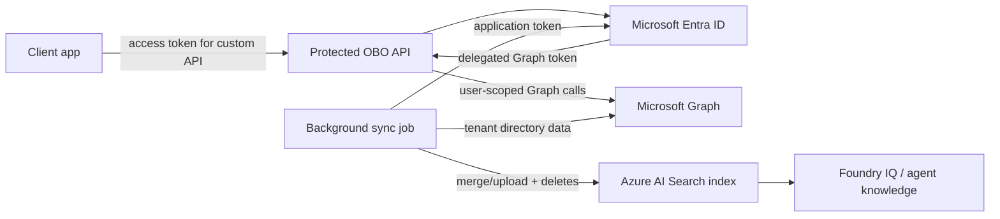

# Architecture

The sync job and the API are separate trust boundaries.

- The sync job uses application permissions to read tenant directory data and writes normalized user documents to Search.
- The API validates a user token for its own audience and then uses OBO to call Graph on the signed-in user's behalf.

Manager relationships are only organizational metadata. They must not be used as document authorization.

The remaining production work is mostly operational: real-tenant validation, Azure deployment, telemetry, and stricter governance around access and retention.
